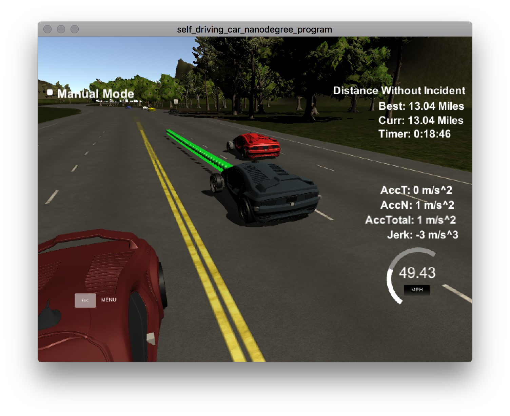

# Path planning project


### The code compiles correctly

The code has been generated for XCode in the `build` directory with the next command:

```
$ cmake -G Xcode ..
```

### The car is able to drive at least 4.32 miles without incident.

The car has been driven for far more than 5 miles without any kind of incident.


### The car drives according to the speed limit.

The car never drives faster thant the speed limit. This speed limit is setup on [line 285 on main.cpp](./scr/main.cpp#L285).

### Max Acceleration and Jerk are not Exceeded.
Max jerk message did not show.

### Car does not have collisions.
Car had no collision along all the running time.

### The car stays in its lane, except for the time between changing lanes.
The car behavior is made so the car stays on the middle lane most of the time except if there is a car ahead and returns to the middle lane right after the overtake.

### The car is able to change lanes
The car change lanes when there is a car ahead which is slower.

## Reflection

The code follows the walkthrough shown by David Silver and Aaron Brown which can be found on the notes for the project.

The code has follow the same structure presented on the walkthrough. So it has not been split into different classes or functions but there are three very distinct parts described below.


### Prediction 

This part of code can be found at [line 250 to line 281](./src/main.cpp#L250).
Here we read the telemetry and sensor fusion data to predict the next states:

- There is a car ahead blocking us.
- There is car on the right not able to make lane change.
- There is car on the left not able to make a lane change.

We calculate the position of the car given the current and we estimate its `s` coordinate given time frame and the number of estimations. If the car is less than 30 meters, either in front or behind us, we flag the car as too close to maneuver.


### Behavior 

This code can be found at[line 283 to line 312](./scr/main.cpp#L283).


The behaviour for the car is very simple:

- Check if we have a car in front of us `car_ahead`.
- If there is a car then:
	- Change lane (first left, then right).
	- If we can't make a lane change then slow down, and follow the car.
- If there is no car in front, speed up until speed limit is reached.

To avoid jerk and unconfortable accelerations, we change the speed a according to `acceleration` variable defined by the constant rate `MAX_ACCELERATION`.


### Trajectory 

This code can be found at [line 321 to line 415](./scr/main.cpp#L321).

This code does the calculation of the trajectory based on the speed and lane output from the behavior, car coordinates and past path points. For this we follow the code shown on the walkthrough previously mentioned.

First, the last two points of the previous trajectory (or the car position if there are no previous trajectory, are used in conjunction three points at a far distance to initialize the spline calculation. To make the work less complicated to the spline calculation based on those points, the coordinates are transformed (shift and rotation) to local car coordinates.

In order to ensure more continuity on the trajectory (in addition to adding the last two point of the pass trajectory to the spline adjustment), the pass trajectory points are copied to the new trajectory. The rest of the points are calculated by evaluating the spline and transforming the output coordinates to not local coordinates. The speed change is decided on the behavior part of the code, but it is used in that part to increase/decrease speed on every trajectory points instead of doing it for the complete trajectory.


